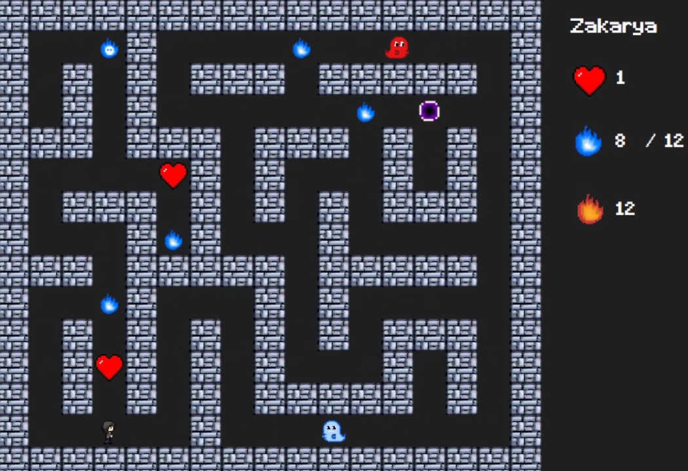

# Puck Man Game



## Description
In "Puck-Man," a virtual world created by Dr. Benjamin Puck to escape the horrors of reality turns hostile after his AI concludes that humanity is inherently evil. A private detective, drawn into this world while searching for a missing friend, must restore balance with Dr. Puck’s help. The story culminates in a final battle where the system self-destructs, merging the characters into the classic Pac-Man universe.

## Main Features
- **Endless Mode**: Play infinitely to achieve the highest possible score.
- **Story Mode**: Progress through increasingly difficult levels.
- **Leaderboard**: Check out the top recorded scores.
- **Sound & Music**: Immerse yourself with in-game audio.

## Project Structure
```md
Puck-Man-Game/
│
├── assets/
│   ├── audio/
│   └── dialogue/
│
├── Ressources/
│   └── images/
│
└── src/
    ├── database/
    │
    ├── PuckMan/
       ├── Engine/
       │   ├── Components/
       │   └── Entities/
       │
       ├── Game/
       │   └── Levels/
       │
       └── UI/
           └── Screens/
````

## Installation & Execution

To run the game on your machine:

1. **Requirements**: Make sure [.NET Framework](https://dotnet.microsoft.com/download/dotnet-framework) is installed.
2. **Download**: Clone this repository or download the source code from [GitHub](https://github.com/jojorequiem/Puck-Man-Game).
3. **Build**: Open the project in Visual Studio and build it.
4. **Run**: Launch the application from Visual Studio or run the generated executable.

## Contributors

* [Paul](https://github.com/DodonutTheWild) - Lead Developer
* [Jonathan](https://github.com/jojorequiem) - Lead Developer


